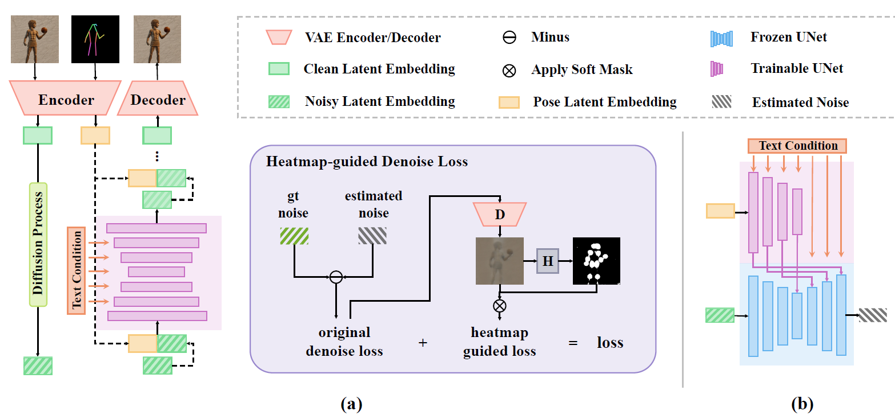
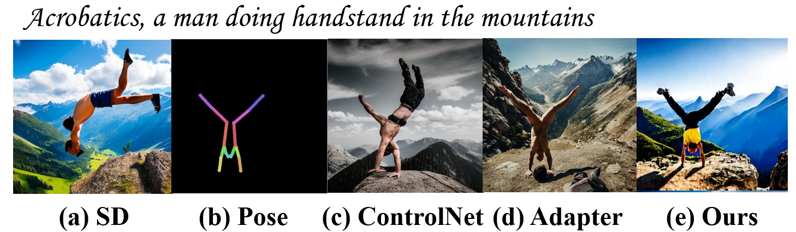
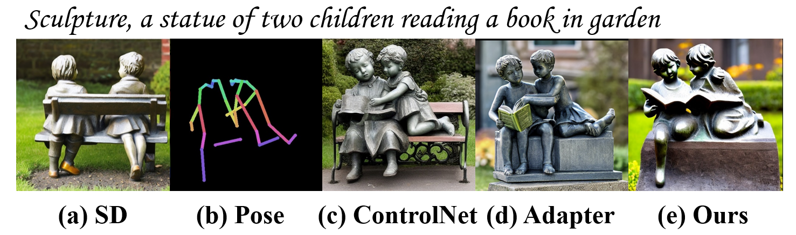

# HumanSD

---

This repository contains the implementation of the following paper:
> **HumanSD: A Native Skeleton-Guided Diffusion Model for Human Image Generation** [[Project Page]](https://idea-research.github.io/HumanSD/) [[Paper]](https://drive.google.com/file/d/15bbqfVZ8tF5HKpYApE2naqk12DNe14TR/view?usp=share_link) [[Code]](https://github.com/IDEA-Research/HumanSD)  
> [Xuan Ju](https://juxuan.space/)∗12, [Chenchen Zhao](https://zcc31415926.github.io/)∗2, [Ailing Zeng](https://ailingzeng.site/)∗1, [Jianan Wang](https://github.com/wendyjnwang/)1, [Qiang Xu](https://cure-lab.github.io/)2, [Lei Zhang](https://www.leizhang.org/)1 
> ∗ Equal contribution 1International Digital Economy Academy 2The Chinese University of Hong Kong

In this work, we propose a native skeleton-guided diffusion model for controllable HIG called HumanSD. Instead of performing image editing with dual-branch diffusion, we fine-tune the original SD model using a novel heatmap-guided denoising loss. This strategy effectively and efficiently strengthens the given skeleton condition during model training while mitigating the catastrophic forgetting effects. HumanSD is fine-tuned on the assembly of
three large-scale human-centric datasets with text-imagepose information, two of which are established in this work. 

---

    

Each group of displayed images includes: (a) a generation by the pre-trained pose-less text-guided [stable diffusion (SD)](https://github.com/Stability-AI/stablediffusion), (b) pose skeleton images as the condition to ControlNet and our proposed HumanSD, (c) a generation by [ControlNet](https://github.com/lllyasviel/ControlNet), and (d) a generation by HumanSD (ours). ControlNet and HumanSD receive both text and pose conditions. HumanSD shows its superiorities in terms of (I) challenging poses, (II) accurate painting styles, (III) pose control capability, (IV) multi-person scenarios, and (V) delicate details. 

As shown in the figure, HumanSD outperforms ControlNet in terms of accurate pose control and image quality, particularly when the given skeleton guidance is sophisticated.

## TODO

- [ ] Release inference code and pretrained models
- [ ] Release Gradio UI and Hugging Face demo
- [ ] Release training code
- [ ] Public training data (LAION-Aesthetics, HIG)

## Model Overview

    

## Quantitative Results

    

## Qualitative Results

- (a) a generation by the pre-trained text-guided [stable diffusion (SD)](https://github.com/Stability-AI/stablediffusion)
- (b) pose skeleton images as the condition to ControlNet, T2I-Adapter and our proposed HumanSD
- (c) a generation by [ControlNet](https://github.com/lllyasviel/ControlNet)
- (d) a generation by [T2I-Adapter](https://github.com/TencentARC/T2I-Adapter)
- (e) a generation by HumanSD (ours). 

ControlNet, T2I-Adapter, and HumanSD receive both text and pose conditions.

### Natural Scene

    

    

    

    

    

### Sketch Scene

    

    

### Shadow Play Scene

    

### Children Drawing Scene

    

### Oil Painting Scene

    

### Watercolor Scene

    

### Digital Art Scene

    

### Relief Scene

    

### Sculpture Scene

    

