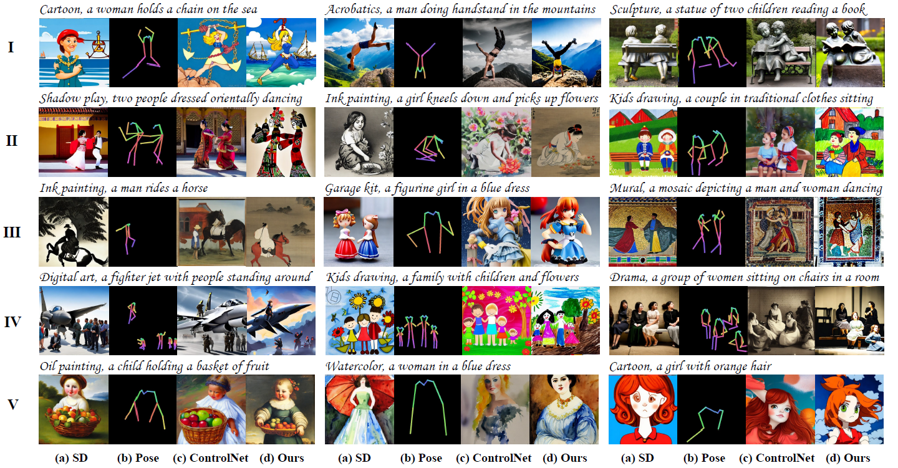
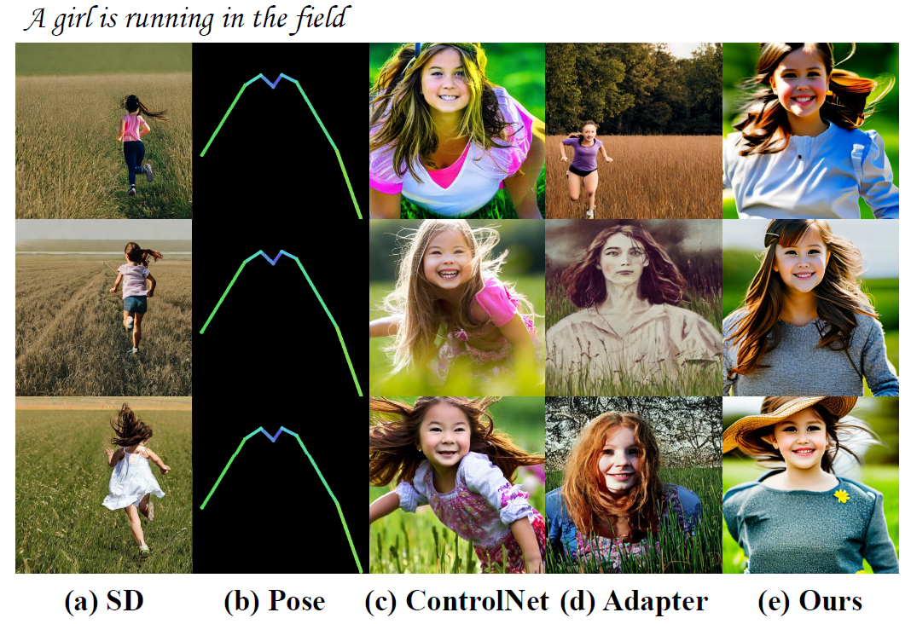
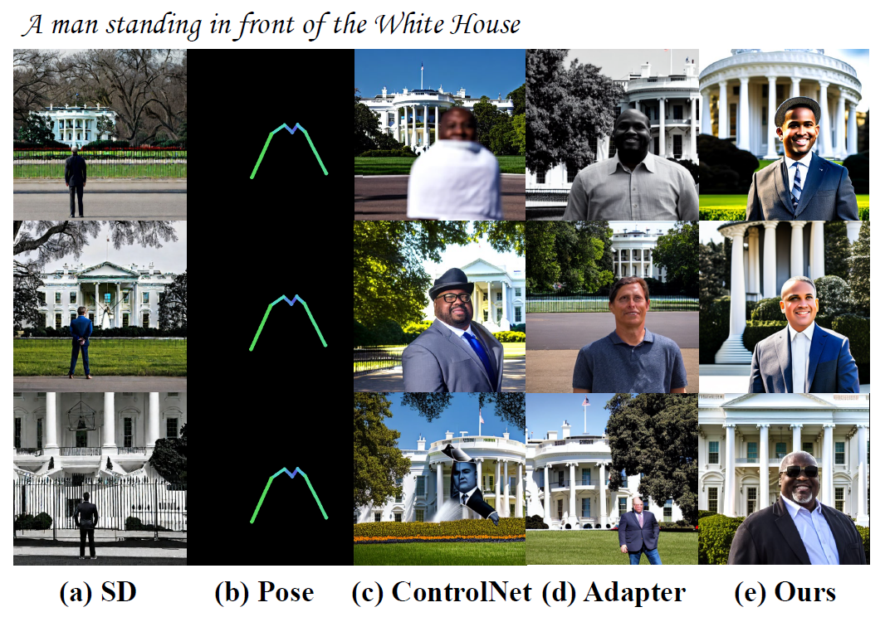
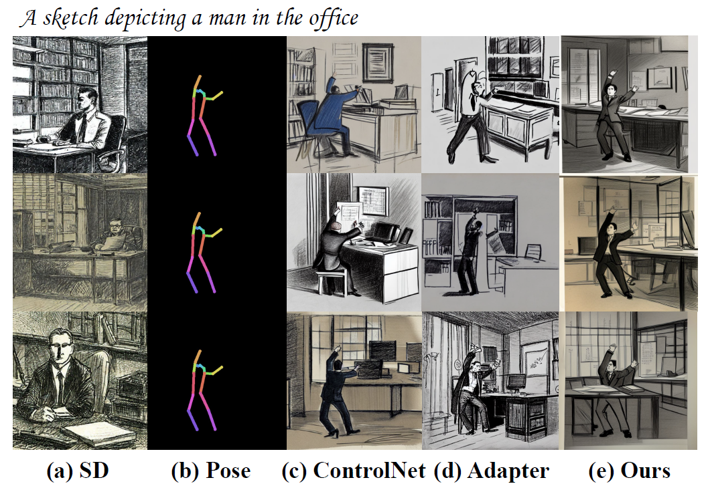
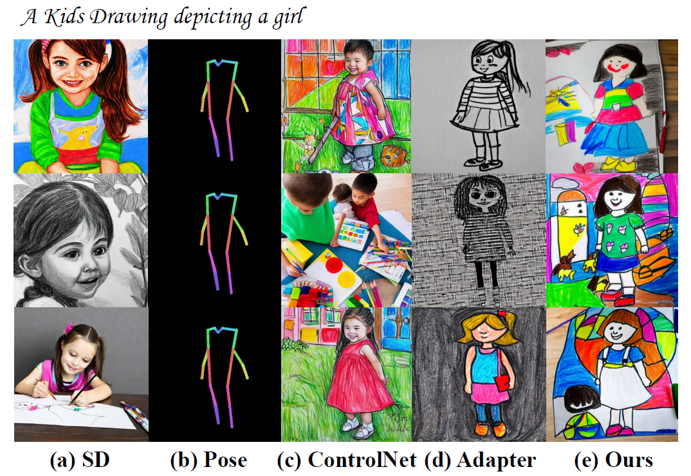
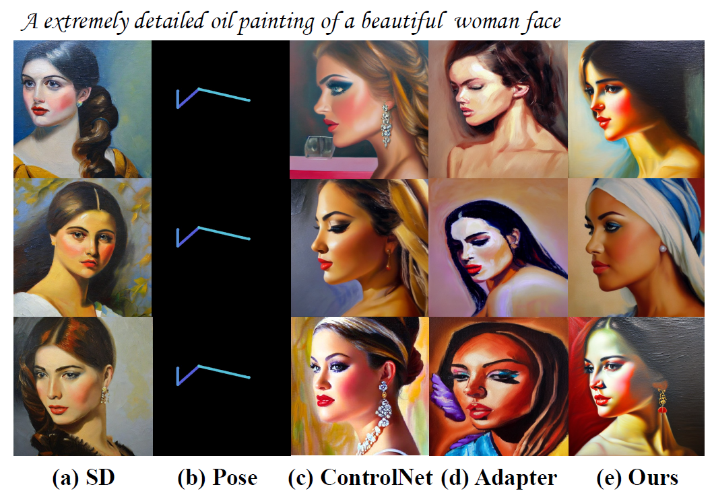

# HumanSD

---

This repository contains the implementation of the following paper:
> **HumanSD: A Native Skeleton-Guided Diffusion Model for Human Image Generation** [[Project Page]](https://idea-research.github.io/HumanSD/) [[Paper]](https://arxiv.org/abs/2304.04269) [[Code]](https://github.com/IDEA-Research/HumanSD) [[Video]](https://drive.google.com/file/d/1Djc2uJS5fmKnKeBnL34FnAAm3YSH20Bb/view?usp=sharing) [[Data]](https://forms.gle/ANxDTjxcE2Ua45oU8) <br>
> [Xuan Ju](https://juxuan.space/)<sup>∗12</sup>, [Ailing Zeng](https://ailingzeng.site/)<sup>∗1</sup>, [Chenchen Zhao](https://zcc31415926.github.io/)<sup>∗2</sup>, [Jianan Wang](https://github.com/wendyjnwang/)<sup>1</sup>, [Lei Zhang](https://www.leizhang.org/)<sup>1</sup>, [Qiang Xu](https://cure-lab.github.io/)<sup>2</sup><br>
> <sup>∗</sup> Equal contribution <sup>1</sup>International Digital Economy Academy <sup>2</sup>The Chinese University of Hong Kong


In this work, we propose a native skeleton-guided diffusion model for controllable HIG called HumanSD. Instead of performing image editing with dual-branch diffusion, we fine-tune the original SD model using a novel heatmap-guided denoising loss. This strategy effectively and efficiently strengthens the given skeleton condition during model training while mitigating the catastrophic forgetting effects. HumanSD is fine-tuned on the assembly of
three large-scale human-centric datasets with text-imagepose information, two of which are established in this work. 

---

<div  align="center">    

</div>


- (a) a generation by the pre-trained pose-less text-guided [stable diffusion (SD)](https://github.com/Stability-AI/stablediffusion)
- (b) pose skeleton images as the condition to ControlNet and our proposed HumanSD
- (c) a generation by [ControlNet](https://github.com/lllyasviel/ControlNet)
- (d) a generation by HumanSD (ours). ControlNet and HumanSD receive both text and pose conditions. 

HumanSD shows its superiorities in terms of (I) challenging poses, (II) accurate painting styles, (III) pose control capability, (IV) multi-person scenarios, and (V) delicate details. 

**Table of Contents**

  - [Model Overview](#model-overview)
  - [Getting Started](#getting-started)
    - [Environment Requirement](#environment-requirement)
    - [Model and Checkpoints](#model-and-checkpoints)
    - [Quick Demo](#quick-demo)
    - [Dataset](#dataset)
  - [Quantitative Results](#quantitative-results)
  - [Qualitative Results](#qualitative-results)
    - [Natural Scene](#natural-scene)
    - [Sketch Scene](#sketch-scene)
    - [Shadow Play Scene](#shadow-play-scene)
    - [Children Drawing Scene](#children-drawing-scene)
    - [Oil Painting Scene](#oil-painting-scene)
    - [Watercolor Scene](#watercolor-scene)
    - [Digital Art Scene](#digital-art-scene)
    - [Relief Scene](#relief-scene)
    - [Sculpture Scene](#sculpture-scene)
  - [Cite Us](#cite-us)
  - [Acknowledgement](#acknowledgement)


## TODO

- [x] Release inference code and pretrained models
- [x] Release Gradio UI demo
- [x] Public training data (LAION-Human)
- [ ] Release training code (will be public after received)

## Model Overview

<div  align="center">    

</div>

## Getting Started
### Environment Requirement

HumanSD has been implemented and tested on Pytorch 1.12.1 with python 3.9.

Clone the repo:
```bash
git clone --recursive git@github.com:IDEA-Research/HumanSD.git
```

We recommend you first install `pytorch` following [official instructions](https://pytorch.org/get-started/previous-versions/). For example:

```bash
# conda
conda install pytorch==1.12.1 torchvision==0.13.1 torchaudio==0.12.1 cudatoolkit=11.3 -c pytorch
```

Then, you can install required packages thourgh:

```bash
pip install -r requirements.txt
```

You also need to install MMPose following [here](https://github.com/open-mmlab/mmpose). Noted that you only need to install MMPose as a python package.

### Model and Checkpoints


**Checkpoints**

Download necessary checkpoints of HumanSD, which can be found [here](https://drive.google.com/drive/folders/1NLQAlF7i0zjEpd-XY0EcVw9iXP5bB5BJ?usp=sharing). The data structure should be like:

```
|-- humansd_data
    |-- checkpoints
        |-- higherhrnet_w48_humanart_512x512_udp.pth
        |-- v2-1_512-ema-pruned.ckpt
        |-- humansd-v1.ckpt
```

Noted that v2-1_512-ema-pruned.ckpt should be download from [Stable Diffusion](https://github.com/Stability-AI/stablediffusion).


**models**


You also need to prepare the configs of MMPose models. You can directly download [mmpose/configs](https://github.com/open-mmlab/mmpose/tree/main/configs) and put it into humansd_data. Then the data structure will be:

```
|-- humansd_data
    |-- models
        |-- mmpose
            |-- configs
                |-- _base_
                |-- animal
                |-- ...
```


### Quick Demo

You can run demo through:

```
python scripts/gradio/pose2img.py
```

We have also provided the comparison of ControlNet and T2I-Adapter, you can run all these methods in one demo. But you need to download corresponding model and checkpoints following:
<details> <summary>To compare ControlNet, and T2I-Adpater's results.</summary>
(1) You need to initialize ControlNet and T2I-Adapter as submodule using 

```
git submodule init
git submodule update
```
(2) Then download checkpoints from: a. [T2I-Adapter](https://huggingface.co/TencentARC/T2I-Adapter/resolve/main/models/t2iadapter_openpose_sd14v1.pth) 
b. [ControlNet](https://huggingface.co/lllyasviel/ControlNet-v1-1/resolve/main/control_v11p_sd15_openpose.pth). 
And put them into humansd_data/checkpoints

Then, run:

```
python scripts/gradio/pose2img.py --controlnet --t2i
```

Noted that you may have to modify some code in T2I-Adapter due to the path conflict. 

e.g., use

```
from comparison_models.T2IAdapter.ldm.models.diffusion.ddim import DDIMSampler
```

instead of 

```
from T2IAdapter.ldm.models.diffusion.ddim import DDIMSampler
```

</details>


### Dataset

You may refer to the code [here](ldm/data/humansd.py) for loading the data.

**Laion-Human**


You may apply for access of Laion-Human [here](https://forms.gle/ANxDTjxcE2Ua45oU8). Noted that we have provide the pose annotations, images' .parquet file and mapping file, please download the images according to .parquet. The `key` in .parquet is the corresponding image index. For example, image with `key=338717` in 00033.parquet is corresponding to images/00000/000338717.jpg. If you download the LAION-Aesthetics in tar files, which is different from our data structure, we recommend you extract the tar file through code:

```python
import tarfile
tar_file="00000.tar" # 00000.tar - 00286.tar
present_tar_path=f"xxxxxx/{tar_file}"
save_dir="humansd_data/datasets/Laion/Aesthetics_Human/images"
with tarfile.open(present_tar_path, "r") as tar_file:
    for present_file in tar_file.getmembers():
        if present_file.name.endswith(".jpg"):
            print(f"     image:- {present_file.name} -")
            image_save_path=os.path.join(save_dir,tar_file.replace(".tar",""),present_file.name)
            present_image_fp=TarIO.TarIO(present_tar_path, present_file.name)
            present_image=Image.open(present_image_fp)
            present_image_numpy=cv2.cvtColor(np.array(present_image),cv2.COLOR_RGB2BGR)
            if not os.path.exists(os.path.dirname(image_save_path)):
                os.makedirs(os.path.dirname(image_save_path))
            cv2.imwrite(image_save_path,present_image_numpy)
```

The file data structure should be like:

```
|-- humansd_data
    |-- datasets
        |-- Laion 
            |-- Aesthetics_Human
                |-- images
                    |-- 00000
                        |-- 000000000.jpg
                        |-- 000000001.jpg
                        |-- ...
                    |-- 00001
                    |-- ...
                |-- pose
                    |-- 00000
                        |-- 000000000.npz
                        |-- 000000001.npz
                        |-- ...
                    |-- 00001
                    |-- ... 
                |-- mapping_file_training.json        
```

**Human-Art**


You may download [Human-Art](https://idea-research.github.io/HumanArt/) dataset [here](https://forms.gle/UVv1GiNJNQsE4qif7).

The file data structure should be like:

```
|-- humansd_data
    |-- datasets
        |-- HumanArt 
            |-- images
                |-- 2D_virtual_human
                    |-- cartoon
                        |-- 000000000007.jpg
                        |-- 000000000019.jpg
                        |-- ...
                    |-- digital_art
                    |-- ...
                |-- 3D_virtual_human
                |-- real_human
            |-- pose
                |-- 2D_virtual_human
                    |-- cartoon
                        |-- 000000000007.npz
                        |-- 000000000019.npz
                        |-- ...
                    |-- digital_art
                    |-- ...
                |-- 3D_virtual_human
                |-- real_human
            |-- mapping_file_training.json   
            |-- mapping_file_validation.json     
```


## Quantitative Results

<div  align="center">    

</div>

## Qualitative Results


- (a) a generation by the pre-trained text-guided [stable diffusion (SD)](https://github.com/Stability-AI/stablediffusion)
- (b) pose skeleton images as the condition to ControlNet, T2I-Adapter and our proposed HumanSD
- (c) a generation by [ControlNet](https://github.com/lllyasviel/ControlNet)
- (d) a generation by [T2I-Adapter](https://github.com/TencentARC/T2I-Adapter)
- (e) a generation by HumanSD (ours). 

ControlNet, T2I-Adapter, and HumanSD receive both text and pose conditions.

### Natural Scene

<div  align="center">    

</div>

<div  align="center">    

</div>


<div  align="center">    

</div>


<div  align="center">    

</div>


<div  align="center">    

</div>

### Sketch Scene

<div  align="center">    

</div>


<div  align="center">    

</div>

### Shadow Play Scene

<div  align="center">    

</div>

### Children Drawing Scene

<div  align="center">    

</div>

### Oil Painting Scene

<div  align="center">    

</div>

<div  align="center">    

</div>

### Watercolor Scene

<div  align="center">    

</div>

### Digital Art Scene

<div  align="center">    

</div>

### Relief Scene

<div  align="center">    

</div>

### Sculpture Scene

<div  align="center">    

</div>


## Cite Us

```bibtex
@article{ju2023humansd,
  title={Human{SD}: A Native Skeleton-Guided Diffusion Model for Human Image Generation},
  author={Ju, Xuan and Zeng, Ailing and Zhao, Chenchen and Wang, Jianan and Zhang, Lei and Xu, Qiang},
  journal={arXiv preprint arXiv:2304.04269},
  year={2023}
}
@inproceedings{ju2023human,
    title={Human-Art: A Versatile Human-Centric Dataset Bridging Natural and Artificial Scenes},
    author={Ju, Xuan and Zeng, Ailing and Wang, Jianan and Xu, Qiang and Zhang, Lei},
    booktitle={Proceedings of the IEEE/CVF Conference on Computer Vision and Pattern Recognition},
    year={2023},
}
```


## Acknowledgement

- Our code is modified on the basis of [Stable Diffusion](https://github.com/Stability-AI/stablediffusion), thanks to all the contributors!
- HumanSD would not be possible without [LAION](https://laion.ai/) and their efforts to create open, large-scale datasets.
- Thanks to [the DeepFloyd team](https://twitter.com/deepfloydai) at Stability AI, for creating the subset of [LAION-5B](https://laion.ai/blog/laion-5b/) dataset used to train HumanSD.
- HumanSD uses [OpenCLIP](https://laion.ai/blog/large-openclip/), trained by [Romain Beaumont](https://github.com/rom1504).

